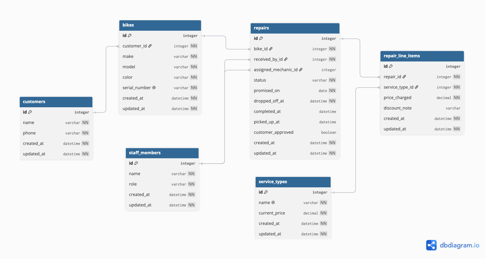
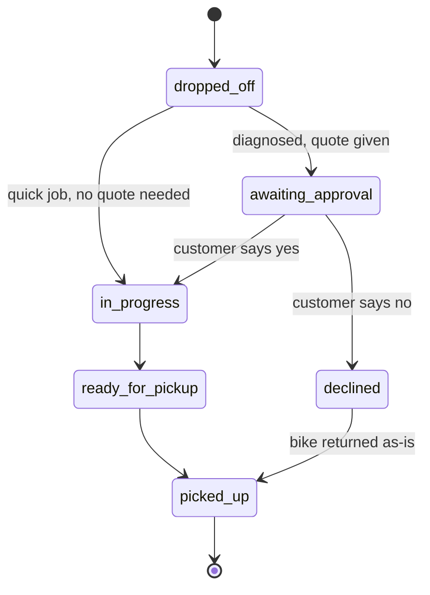

## Diagram



## Code

```dbml
Table customers {
  id integer [pk]
  name varchar [not null]
  phone varchar [not null]
  created_at datetime [not null]
  updated_at datetime [not null]
}

Table staff_members {
  id integer [pk]
  name varchar [not null]
  role varchar [not null]
  created_at datetime [not null]
  updated_at datetime [not null]
}

Table service_types {
  id integer [pk]
  name varchar [unique, not null]
  current_price decimal [not null]
  created_at datetime [not null]
  updated_at datetime [not null]
}

Table bikes {
  id integer [pk]
  customer_id integer [ref: > customers.id, not null]
  make varchar [not null]
  model varchar [not null]
  color varchar [not null]
  serial_number varchar [unique, not null]
  created_at datetime [not null]
  updated_at datetime [not null]
}

Table repairs {
  id integer [pk]
  bike_id integer [ref: > bikes.id, not null]
  received_by_id integer [ref: > staff_members.id, not null]
  assigned_mechanic_id integer [ref: > staff_members.id, null]
  status varchar [not null, default: `'dropped_off'`]
  promised_on date [not null]
  dropped_off_at datetime [not null]
  completed_at datetime [null]
  picked_up_at datetime [null]
  customer_approved boolean [null]
  created_at datetime [not null]
  updated_at datetime [not null]
}

Table repair_line_items {
  id integer [pk]
  repair_id integer [ref: > repairs.id, not null]
  service_type_id integer [ref: > service_types.id, not null]
  price_charged decimal [not null]
  discount_note varchar [null]
  created_at datetime [not null]
  updated_at datetime [not null]
}
```

## Lifecycle

A repair moves through these states:



**Not allowed, and why:**

- `declined → in_progress` — once the customer has said no, staff cannot decide to start work anyway. If the customer changes their mind, that is a new decision and should go back through `awaiting_approval`
- `ready_for_pickup → awaiting_approval`, or any move backwards — a finished repair cannot be un-finished. A mistake here is corrected with a note on the repair, not by rewinding its state.
- `picked_up → anything` — picked up is the end of the line. A bike that comes back later is a new repair, linked to the same bike, not a reopening of the old one.
- `dropped_off → picked_up` directly — every repair must pass through either `ready_for_pickup` or `declined`. There is no "skip the workshop entirely" path.

## Every entity traces to a story

| Entity | Required by story |
|---|---|
| `customers` | 1, 2, 10 |
| `bikes` | 1, 9 |
| `staff_members` | 1, 6, 7, 9 |
| `repairs` | 2, 3, 5, 8, 10, 11, 13 |
| `service_types` | 7, 12 |
| `repair_line_items` | 7 |


## Two decisions

**The thing and the copy of the thing.** The owner's story about two blue Trek Marlins is exactly
the failure a single `bikes` table with a `quantity` column would produce: it could tell you the
shop has seen two blue Marlins, but not which one is on the rack right now, who dropped it off, or
that unit #2 came back last year with a cracked fork. Giving every bike its own row, keyed by a
unique `serial_number`, is what lets a repair and a history attach to one physical object instead of
to "a Trek Marlin" in the abstract.

**Derived, or stored?** Whether a repair is late is not stored — it's calculated by comparing
`promised_on` to today's date, so it can never go stale. `repair_line_items.price_charged`, on the
other hand, is stored, even though it looks like it could just be read from
`service_types.current_price`. It can't be: the price list changes every January, and staff
sometimes charge less than list price. Without a stored snapshot, old invoices would silently change
value every time the list updates — the one thing the owner said must never happen.

## Changes since Lab 3

- **`repair_photos` removed for now.**
- **`repairs.diagnosis_notes` removed for now.** 
- **`created_at`/`updated_at` added to every table.** Rails requires these on every model; Lab 3 didn't draw them because the diagram wasn't yet tied to Rails' conventions.
- **Every mandatory column is now explicitly `NOT NULL`**, enforced by the database itself — a bike without an owner, or a repair without a bike, cannot be inserted from anywhere, not even the console.
- **Unique indexes added** on `bikes.serial_number` and `service_types.name`, so the database refuses duplicates on its own, not just application code.
- **Money columns are `decimal(10,2)`**, not a plain `integer` as the Lab 3 diagram implied, so cents are represented correctly.
- **`repairs.status` has a default** (`'dropped_off'`), matching the first state of the lifecycle above — a repair inserted with no state starts there.
- **Foreign key columns are the same type as the `id` column they point at** (Rails' default bigint primary key), as required.
- No tables were renamed, and no column names changed from Lab 3.
