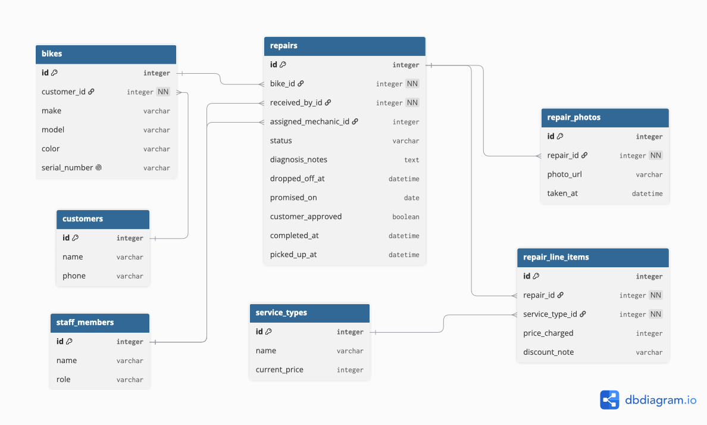

## Diagram

## Code

Table customers {
  id integer [pk]
  name varchar
  phone varchar
}

Table bikes {
  id integer [pk]
  customer_id integer [ref: > customers.id, not null]
  make varchar
  model varchar
  color varchar
  serial_number varchar [unique]
}

Table staff_members {
  id integer [pk]
  name varchar
  role varchar // "front_desk" or "mechanic"
}

Table service_types {
  id integer [pk]
  name varchar
  current_price integer
}

Table repairs {
  id integer [pk]
  bike_id integer [ref: > bikes.id, not null]
  received_by_id integer [ref: > staff_members.id, not null]
  assigned_mechanic_id integer [ref: > staff_members.id, null]
  status varchar
  diagnosis_notes text [null]
  dropped_off_at datetime
  promised_on date
  customer_approved boolean [null]
  completed_at datetime [null]
  picked_up_at datetime [null]
}

Table repair_line_items {
  id integer [pk]
  repair_id integer [ref: > repairs.id, not null]
  service_type_id integer [ref: > service_types.id, not null]
  price_charged integer
  discount_note varchar [null]
}

Table repair_photos {
  id integer [pk]
  repair_id integer [ref: > repairs.id, not null]
  photo_url varchar
  taken_at datetime
}

## Lifecycle

A repair moves through these states:

'''
    [*] --> dropped_off
    dropped_off --> in_progress: quick job, no quote needed
    dropped_off --> awaiting_approval: diagnosed, quote given
    awaiting_approval --> in_progress: customer says yes
    awaiting_approval --> declined: customer says no
    in_progress --> ready_for_pickup
    ready_for_pickup --> picked_up
    declined --> picked_up: bike returned as-is
    picked_up --> [*]
'''

** Not allowed, and why **

- `declined → in_progress` : once the customer has said no, staff cannot decide to start work anyway. If the customer changes their mind, that is a new decision and should go back through `awaiting_approval`.
- `ready_for_pickup → awaiting_approval`, or any move backwards, a finished repair cannot be un-finished. A mistake here is corrected with a note on the repair, not by rewinding its state.
- `picked_up → anything` : picked up is the end of the line. A bike that comes back later is a new repair, linked to the same bike, not a reopening of the old one.
- `dropped_off → picked_up` directly : every repair must pass through either `ready_for_pickup` or `declined`. There is no "skip the workshop entirely" path.

## Every entity traces to a story

| Entity | Required by story |
|---|---|
| `customers` | 1, 2, 10 |
| `bikes` | 1, 9 |
| `staff_members` | 1, 6, 7, 9 |
| `repairs` | 2, 3, 5, 8, 10, 11, 13 |
| `service_types` | 7, 12 |
| `repair_line_items` | 7 |
| `repair_photos` | 4 |

## Two decisions

**The thing and the copy of the thing.** The owner's story about two blue Trek Marlins is exactly the failure a single bikes table with a quantity column would produce: it could tell you the shop has seen two blue Marlins, but not which one is on the rack right now, who dropped it off, or that unit #2 came back last year with a cracked fork. Giving every bike its own row, keyed by a unique serial_number, is what lets a repair, a diagnosis and a history attach to one physical object instead of to "a Trek Marlin" in the abstract.

**Derived, or stored?** Whether a repair is late is not stored — it's just calculated by comparing promised_on to today's date. That way it can never go stale if someone changes the promised date. repair_line_items.price_charged, on the other hand, is stored, even though it looks like it could just be read from service_types.current_price. It can't be: the price list changes every January, and staff sometimes charge less than list price. Without a stored snapshot, old invoices would silently change value every time the list updates — the one thing the owner said must never happen.
